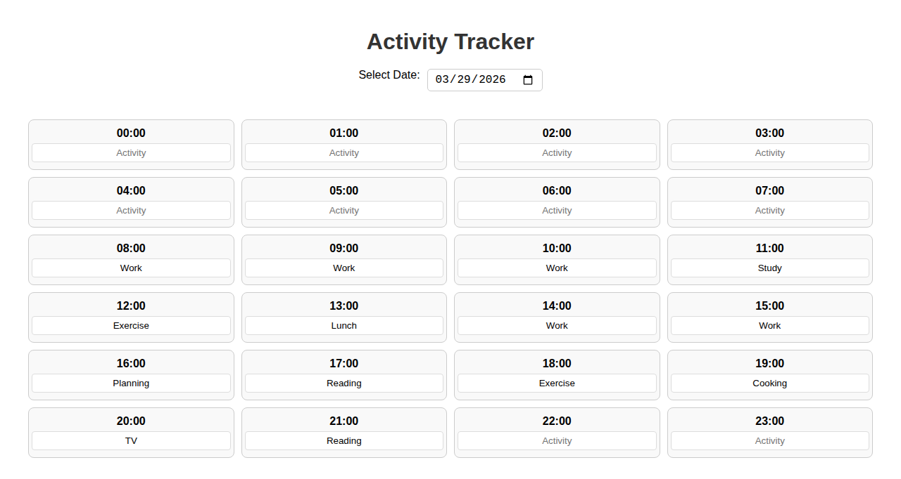
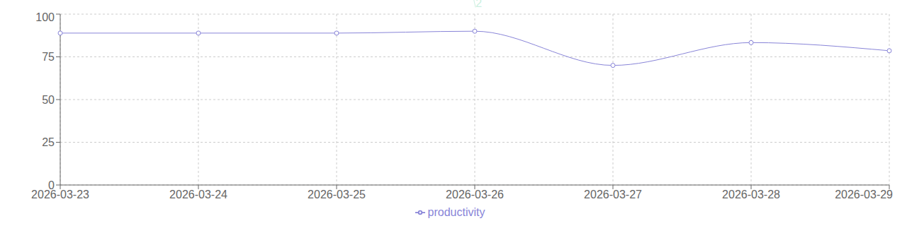

# Activity Tracker

A daily activity tracking app built with React and TypeScript. Log what you do each hour of the day, visualize your productivity, and track trends over time — all stored locally in your browser.

## Live Demo

[View on Vercel](https://activity-tracker-pranitauppalapati.vercel.app)

## Screenshots

### Daily Activity Grid
Log activities for each hour of the day. Filled cells are color-coded by activity.



### Productivity Overview
Pie chart showing productive vs. non-productive hours for the day, week, or month.


### Activity Breakdown
See how your time is distributed across all activities.


### Weekly Productivity Trends
Line chart tracking your productivity percentage over the past 7 days.



## Features

- **24-hour daily grid** — type an activity into any hour slot
- **Color-coded cells** — each unique activity gets its own pastel color
- **Date picker** — navigate to any past or future date
- **Customizable productive activities** — define what counts as "productive" for you
- **Productivity Overview** — pie chart (productive vs. non-productive) with day / week / month tabs
- **Activity Breakdown** — pie chart of time spent per activity with day / week / month tabs
- **Weekly Trends** — line chart of your productivity % over the last 7 days
- **Persistent storage** — all data saved in `localStorage`, no account required

## Tech Stack

| Layer    | Technology                        |
|----------|-----------------------------------|
| Frontend | React 18, TypeScript, Recharts    |
| Backend  | Node.js, Express, MongoDB         |
| Docker   | docker-compose for local dev      |
| Hosting  | Vercel (frontend)                 |

## Getting Started

### Prerequisites

- Node.js 16+
- npm 8+

### Run frontend only

```bash
cd frontend
npm install
npm start
```

Open [http://localhost:3000](http://localhost:3000).

### Run full stack with Docker

```bash
docker-compose up --build
```

- Frontend: [http://localhost:3000](http://localhost:3000)
- Backend API: [http://localhost:4000](http://localhost:4000)

### Environment variables (backend)

Create `backend/.env`:

```
MONGO_URI=your_mongodb_connection_string
PORT=4000
```

## Deployment

The frontend is deployed to Vercel. The `vercel.json` at the repo root configures the build:

```json
{
  "buildCommand": "npm run build -w frontend",
  "outputDirectory": "frontend/build",
  "installCommand": "npm install"
}
```

To deploy your own instance, import the repository into [Vercel](https://vercel.com) — no additional configuration needed.
